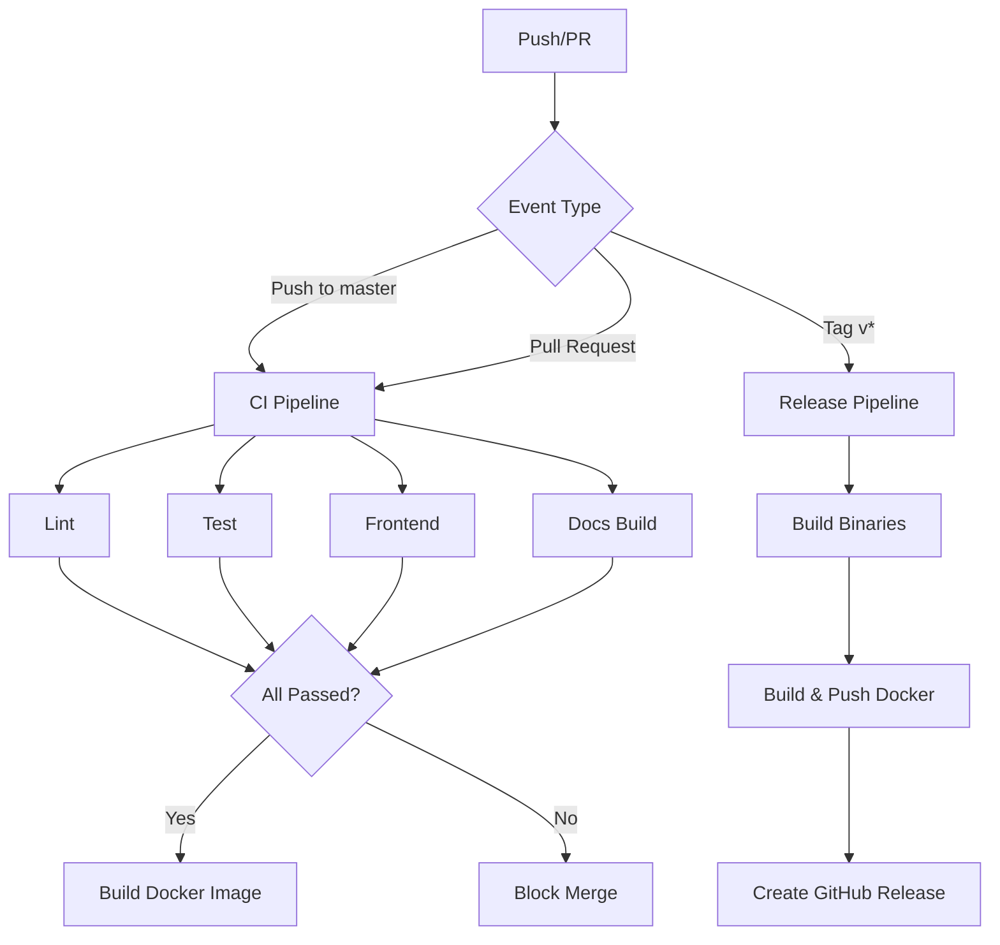

# 设计文档：Open Source Excellence

> 本文档描述如何将 ChatRoom 项目从教学 Demo 提升为符合开源社区标准的优秀项目。

---

## 概述

### 项目当前状态

| 组件 | 技术 |
|------|------|
| 后端 | Go 1.24 + Gin + GORM + gorilla/websocket |
| 前端 | React 19 + TypeScript + Vite 7 + Tailwind CSS v4 |
| 数据库 | PostgreSQL 16 |
| 监控 | Prometheus + Grafana |
| CI/CD | GitHub Actions |

### 目标

- 建立清晰的项目结构
- 完善文档体系
- 建立测试安全网
- 规范贡献流程
- 建立专业开源标准

---

## 架构设计

### 项目目录结构

```
chatroom/
├── .github/
│   ├── workflows/
│   │   ├── ci.yml              # 主 CI 流水线
│   │   ├── release.yml         # 发布流水线
│   │   ├── pages.yml           # 文档部署
│   │   └── security.yml        # 安全扫描
│   ├── ISSUE_TEMPLATE/
│   │   ├── bug_report.md
│   │   └── feature_request.md
│   ├── PULL_REQUEST_TEMPLATE.md
│   └── dependabot.yml
├── cmd/server/
├── internal/
├── frontend/
├── web/
├── docs/
│   ├── .vitepress/
│   ├── API.md
│   ├── ARCHITECTURE.md
│   ├── DESIGN.md
│   └── monitoring/
├── deploy/
│   ├── docker/
│   │   └── Dockerfile
│   └── k8s/
│       ├── deployment.yaml
│       ├── service.yaml
│       └── configmap.yaml
├── changelog/
├── .editorconfig
├── .env.example
├── .golangci.yml
├── CHANGELOG.md
├── CODE_OF_CONDUCT.md
├── CONTRIBUTING.md
├── LICENSE
├── SECURITY.md
├── Makefile
├── README.md
└── README.zh-CN.md
```

### CI/CD 流水线架构


```mermaid
flowchart TD
    A[Push/PR] --> B{Event Type}
    B -->|Push to master| C[CI Pipeline]
    B -->|Pull Request| C
    B -->|Tag v*| D[Release Pipeline]
    
    C --> E[Lint]
    C --> F[Test]
    C --> G[Frontend]
    C --> H[Docs Build]
    
    E --> I{All Passed?}
    F --> I
    G --> I
    H --> I
    
    I -->|Yes| J[Build Docker Image]
    I -->|No| K[Block Merge]
    
    D --> L[Build Binaries]
    L --> M[Build & Push Docker]
    M --> N[Create GitHub Release]
```

---

## 组件设计

### 1. 开源标准文件组件

| 文件 | 用途 | 模板来源 |
|------|------|----------|
| LICENSE | MIT 开源许可证 | SPDX 标准 |
| CONTRIBUTING.md | 贡献指南 | GitHub 社区标准 |
| CODE_OF_CONDUCT.md | 行为准则 | Contributor Covenant 2.1 |
| SECURITY.md | 安全漏洞报告 | GitHub 安全策略 |
| CHANGELOG.md | 版本变更记录 | Keep a Changelog |

### 2. CI/CD 组件

**主 CI 流水线 (ci.yml)**：

```yaml
jobs:
  lint:        # golangci-lint 检查
  test:        # go test -race -cover
  frontend:    # npm test + lint + build
  docs:        # VitePress 构建
  build:       # 二进制构建
  docker:      # Docker 镜像构建（仅 master）
```

**发布流水线 (release.yml)**：

```yaml
jobs:
  validate:        # 运行测试
  build-frontend:  # 构建前端
  build-binaries:  # 多平台二进制
  build-docker:    # 多架构镜像
  create-release:  # 创建 GitHub Release
```

### 3. 代码质量组件

**golangci-lint 配置 (.golangci.yml)**：

```yaml
linters:
  enable:
    - errcheck      # 未处理的错误
    - gosimple      # 简化代码建议
    - govet         # Go vet 检查
    - ineffassign   # 无效赋值
    - staticcheck   # 静态分析
    - unused        # 未使用代码
    - gofmt         # 格式化检查
    - goimports     # import 排序
    - misspell      # 拼写检查
    - gosec         # 安全检查
```

### 4. 容器化组件

**多阶段 Dockerfile**：

```dockerfile
# Stage 1: Frontend build
FROM node:20-alpine AS frontend

# Stage 2: Backend build
FROM golang:1.24-alpine AS builder

# Stage 3: Runtime
FROM alpine:3.21
```

### 5. 健康检查接口

| 端点 | 用途 | 响应 |
|------|------|------|
| `/health` | 存活检查 | `{"status": "ok"}` |
| `/healthz` | K8s 存活检查 | `{"status": "ok"}` |
| `/ready` | 就绪检查（含 DB） | `{"status": "ready", "checks": {...}}` |
| `/version` | 版本信息 | `{"version": "v0.2.0", ...}` |

---

## 正确性属性

### Property 1: 代码格式化一致性

> 对于项目中的任何 Go 源文件，运行 `gofmt -d` 不应产生任何输出。

**验证方式**：`make fmt` 或 `gofmt -l .`

### Property 2: Linter 合规性

> 对于项目中的任何 Go 源文件，运行 `golangci-lint run` 不应产生错误或警告。

**验证方式**：`make lint` 或 CI 自动检查

### Property 3: 导出函数测试覆盖

> internal 包中的任何导出函数，应至少有一个测试用例。

**验证方式**：`go test -cover ./...`

### Property 4: 健康端点正确性

> 对于 `/health` 端点的任何有效 HTTP 请求，响应应为 HTTP 200，JSON 体包含 `status` 字段值为 `"ok"`。

**验证方式**：集成测试

### Property 5: 无密钥泄露

> 仓库中的任何文件，扫描常见密钥模式不应发现匹配。

**验证方式**：gosec, trivy

### Property 6: 生产环境 JWT 密钥验证

> 在生产模式（`APP_ENV=prod`）下使用默认 JWT_SECRET 启动应用时，应用应拒绝启动并输出错误信息。

**验证方式**：配置校验逻辑

---

## 测试策略

### 测试类型分布

| 测试类型 | 目标覆盖 | 工具 |
|----------|----------|------|
| 单元测试 | 核心业务逻辑 | Go testing + testify |
| 集成测试 | HTTP API、数据库交互 | httptest + testcontainers |
| WebSocket 测试 | 实时消息功能 | gorilla/websocket client |
| 前端测试 | 工具函数、组件 | Vitest + React Testing Library |

### 测试命名规范

```go
// 单元测试：Test<Function>_<Scenario>_<Expected>
func TestHashPassword_ValidInput_ReturnsHash(t *testing.T) {}

// 集成测试：TestIntegration_<Feature>_<Scenario>
func TestIntegration_Login_ValidCredentials_ReturnsTokens(t *testing.T) {}
```

---

## 安全设计

### 已实现的安全措施

| 措施 | 实现方式 |
|------|----------|
| 密码存储 | bcrypt 哈希，cost=10 |
| JWT 密钥校验 | 非 dev 环境强制检查 |
| 速率限制 | IP + 路径维度，令牌桶算法 |
| CORS 校验 | 严格 origin 白名单 |
| 输入验证 | 所有请求参数校验 |
| WebSocket Ticket | 一次性消费，防重放 |

### 生产环境必查项

```bash
# 1. JWT 密钥
JWT_SECRET=<strong-random-secret>  # 必须！

# 2. 运行环境
APP_ENV=production

# 3. 数据库
DATABASE_DSN=<secure-connection-string>

# 4. CORS
ALLOWED_ORIGINS=https://your-domain.com
```

---

## 版本信息模型

构建时注入的版本信息：

```go
var (
    Version   = "dev"
    GitCommit = "unknown"
    BuildTime = "unknown"
)

type VersionInfo struct {
    Version   string `json:"version"`
    GitCommit string `json:"git_commit"`
    BuildTime string `json:"build_time"`
    GoVersion string `json:"go_version"`
}
```

通过 `-ldflags` 注入：

```bash
go build -ldflags="-X main.Version=v0.2.0 -X main.GitCommit=abc123"
```

---

## 扩展方向

### 功能扩展

| 功能 | 实现思路 |
|------|----------|
| 消息富文本 | `messages.metadata JSONB` 字段 |
| 私密房间 | `rooms.visibility` 字段 + 权限检查 |
| 文件上传 | S3/OSS + 预签名 URL |
| 消息搜索 | PostgreSQL 全文索引 |

### 架构扩展

| 场景 | 解决方案 |
|------|----------|
| 高并发 | 连接池调优、消息队列 |
| 多实例 | Redis Pub/Sub 替代 Postgres NOTIFY |
| 全球部署 | 多区域数据库、边缘节点 |

---

## 变更历史

| 日期 | 变更 |
|------|------|
| 2026-03-08 | 初始设计文档创建 |
| 2026-03-08 | 设计文档完善 |
