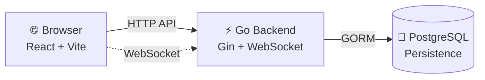

# ChatRoom

[](https://github.com/LessUp/chatroom/actions/workflows/ci.yml)
[](https://lessup.github.io/chatroom/)
[](LICENSE)
[](https://github.com/LessUp/chatroom/releases)
[](https://goreportcard.com/report/github.com/LessUp/chatroom)

English | [简体中文](README.zh-CN.md)

A **teaching-oriented** real-time chat room application demonstrating modern full-stack development practices with Go, React, PostgreSQL, WebSocket, and production-ready CI/CD.

> **Design Philosophy**: Runnable → Understandable → Verifiable → Extendable

---

## 🎯 Who Is This For

This project is designed for:

- 🎓 **Students** learning full-stack development with Go and React
- 👨‍💻 **Developers** exploring real-time communication patterns (WebSocket)
- 🏗️ **Teams** seeking examples of Spec-Driven Development workflow
- 🔍 **Engineers** studying production-ready practices (observability, CI/CD, testing)

**Note**: This project prioritizes code clarity and understanding over feature density.

---

## 🚀 Quick Start

### Prerequisites

- Go 1.24+
- Node.js 20+
- Docker & Docker Compose

### Run Locally

```bash
# 1. Clone the repository
git clone https://github.com/LessUp/chatroom.git && cd chatroom

# 2. Start PostgreSQL
docker compose up -d postgres

# 3. Configure environment (optional for local dev, required for production)
cp .env.example .env
# ⚠️ Edit .env and set JWT_SECRET for production

# 4. Start backend (Terminal 1)
go run ./cmd/server

# 5. Start frontend (Terminal 2) - first time
npm --prefix frontend install
npm --prefix frontend run dev
```

### Access URLs

| Service | URL |
|---------|-----|
| Frontend (Dev) | http://localhost:5173 |
| Backend | http://localhost:8080 |

---

## ✨ Features

### 🔐 Authentication & Security
- JWT access tokens + refresh token rotation
- Secure WebSocket ticket authentication
- Rate limiting and CORS validation
- Password hashing with bcrypt

### 💬 Real-time Chat
- Room-based WebSocket broadcasting
- Typing indicators and online presence
- Cursor-based message pagination
- Message history with persistent storage

### 🔧 Observability & Ops
- Prometheus metrics + Grafana dashboards
- Structured logging with zerolog
- Health check endpoints
- Docker multi-stage builds + Kubernetes manifests

---

## 🏗️ Architecture



### Tech Stack

| Layer | Technology |
|-------|------------|
| **Backend** | Go 1.24, Gin, GORM, gorilla/websocket, zerolog |
| **Frontend** | React 19, TypeScript, Vite 7, Tailwind CSS v4 |
| **Database** | PostgreSQL 16 |
| **Monitoring** | Prometheus, Grafana |
| **Deployment** | Docker, Kubernetes, GitHub Actions |

---

## 📁 Project Structure

```
chatroom/
├── cmd/server/              # Application entry point
├── internal/                # Private packages
│   ├── auth/                # JWT, password hashing, tokens
│   ├── config/              # Configuration loading
│   ├── db/                  # Database connection, migrations
│   ├── server/              # HTTP routes and handlers
│   ├── service/             # Business logic
│   ├── ws/                  # WebSocket Hub, connections
│   ├── mw/                  # Middleware (auth, rate limit, CORS)
│   ├── metrics/             # Prometheus metrics
│   └── models/              # GORM data models
├── frontend/                # React frontend
├── web/                     # Static fallback UI
├── specs/                   # Project specifications (SDD source of truth)
├── docs/                    # VitePress documentation site
├── deploy/                  # Docker, Kubernetes configs
└── changelog/               # Detailed change records
```

---

## 📚 Documentation

### User Documentation
- 📖 [Documentation Site (EN)](https://lessup.github.io/chatroom/en/)
- 📖 [Documentation Site (ZH)](https://lessup.github.io/chatroom/zh/)
- 🚀 [Getting Started](https://lessup.github.io/chatroom/en/getting-started)
- 📚 [API Reference](https://lessup.github.io/chatroom/en/api)
- 🏗️ [Architecture](https://lessup.github.io/chatroom/en/architecture)
- ❓ [FAQ](https://lessup.github.io/chatroom/en/faq)

### Specifications (Single Source of Truth)
- 📋 [Spec Index](specs/README.md) — Complete specification directory
- 📦 [Product Specs](specs/product/) — Requirements and acceptance criteria
- 🏛️ [RFCs](specs/rfc/) — Technical design documents
- 🔌 [API Specs](specs/api/) — Interface specifications
- 🗄️ [DB Specs](specs/db/) — Database schemas

---

## ⚙️ Configuration

Configuration is loaded via environment variables. See `.env.example` for all options.

```bash
# Required for production
JWT_SECRET=your-secure-secret-key

# Optional common settings
APP_PORT=8080
DATABASE_DSN=host=localhost user=postgres password=postgres dbname=chatroom port=5432 sslmode=disable
APP_ENV=dev
```

---

## 🧪 Testing

```bash
# Go backend tests (requires PostgreSQL running)
go test -race ./...

# Frontend tests
npm --prefix frontend run test

# Lint and build
make all
```

---

## 🐳 Docker Deployment

```bash
# Full stack with frontend, backend, and database
docker compose up -d

# With monitoring (Prometheus + Grafana)
docker compose --profile monitoring up -d
```

---

## 🤝 Contributing

See [CONTRIBUTING.md](CONTRIBUTING.md) for guidelines.

We welcome contributions! Please ensure:
- All tests pass: `go test ./...` and `npm --prefix frontend run test`
- Code follows our style guide (see [AGENTS.md](AGENTS.md))
- Specs are updated for any API changes

---

## 🔒 Security

See [SECURITY.md](SECURITY.md) for security policy and best practices.

---

## 📄 Changelog

See [CHANGELOG.md](CHANGELOG.md) for version history.

---

## 📜 License

[MIT License](LICENSE)

---

<p align="center">
  Built with ❤️ for teaching and learning
</p>
