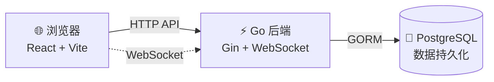

# ChatRoom

[](https://github.com/LessUp/chatroom/actions/workflows/ci.yml)
[](https://lessup.github.io/chatroom/)
[](LICENSE)
[](https://github.com/LessUp/chatroom/releases)
[](https://goreportcard.com/report/github.com/LessUp/chatroom)

[English](README.md) | 简体中文

一个**面向教学**的实时聊天室项目，展示现代全栈开发实践：Go + React + PostgreSQL + WebSocket + 生产级 CI/CD。

> **设计哲学**：可运行 → 可理解 → 可验证 → 可扩展

---

## 🎯 适合谁

本项目适合以下人群：

- 🎓 **学习者** — 学习 Go + React 全栈开发
- 👨‍💻 **开发者** — 探索实时通信模式（WebSocket）
- 🏗️ **团队** — 参考规约驱动开发（SDD）工作流
- 🔍 **工程师** — 研究生产级实践（可观测性、CI/CD、测试）

**说明**：本项目注重代码清晰度和可理解性，而非功能复杂性。

---

## 🚀 快速开始

### 前置要求

- Go 1.24+
- Node.js 20+
- Docker & Docker Compose

### 本地运行

```bash
# 1. 克隆仓库
git clone https://github.com/LessUp/chatroom.git && cd chatroom

# 2. 启动数据库
docker compose up -d postgres

# 3. 配置环境（本地开发可选，生产环境必须）
cp .env.example .env
# ⚠️ 编辑 .env，生产环境必须设置 JWT_SECRET

# 4. 启动后端（终端 1）
go run ./cmd/server

# 5. 启动前端（终端 2）- 首次运行
npm --prefix frontend install
npm --prefix frontend run dev
```

### 访问地址

| 服务 | 地址 |
|------|------|
| 前端开发服务器 | http://localhost:5173 |
| 后端首页 | http://localhost:8080 |

---

## ✨ 核心特性

### 🔐 认证与安全
- JWT Access Token + Refresh Token 自动轮换
- 安全的 WebSocket 票据认证
- 速率限制和 CORS 校验
- bcrypt 密码哈希

### 💬 实时聊天
- 房间级 WebSocket 广播
- 输入提示和在线状态
- 游标分页加载历史消息
- PostgreSQL 持久化存储

### 🔧 可观测与运维
- Prometheus 指标 + Grafana 监控面板
- zerolog 结构化日志
- 健康检查端点
- Docker 多阶段构建 + Kubernetes 清单

---

## 🏗️ 架构



### 技术栈

| 层级 | 技术 |
|------|------|
| **后端** | Go 1.24, Gin, GORM, gorilla/websocket, zerolog |
| **前端** | React 19, TypeScript, Vite 7, Tailwind CSS v4 |
| **数据库** | PostgreSQL 16 |
| **监控** | Prometheus, Grafana |
| **部署** | Docker, Kubernetes, GitHub Actions |

---

## 📁 项目结构

```
chatroom/
├── cmd/server/              # 程序入口
├── internal/                # 内部包
│   ├── auth/                # JWT、密码、Token
│   ├── config/              # 配置管理
│   ├── db/                  # 数据库连接、迁移
│   ├── server/              # HTTP 路由与 Handler
│   ├── service/             # 业务逻辑层
│   ├── ws/                  # WebSocket Hub 与连接
│   ├── mw/                  # 中间件（认证、限流、CORS）
│   ├── metrics/             # Prometheus 指标
│   └── models/              # GORM 数据模型
├── frontend/                # React 前端
├── web/                     # 静态回退 UI
├── specs/                   # 项目规约（SDD 唯一事实来源）
├── docs/                    # VitePress 文档站
├── deploy/                  # Docker、Kubernetes 配置
└── changelog/               # 细粒度变更记录
```

---

## 📚 文档

### 用户文档
- 📖 [文档站（英文）](https://lessup.github.io/chatroom/en/)
- 📖 [文档站（中文）](https://lessup.github.io/chatroom/zh/)
- 🚀 [快速开始](https://lessup.github.io/chatroom/zh/getting-started)
- 📚 [API 文档](https://lessup.github.io/chatroom/zh/api)
- 🏗️ [架构文档](https://lessup.github.io/chatroom/zh/architecture)
- ❓ [常见问题](https://lessup.github.io/chatroom/zh/faq)

### 规约（唯一事实来源）
- 📋 [规约索引](specs/README.md) — 完整的规约目录
- 📦 [产品规约](specs/product/) — 需求和验收标准
- 🏛️ [RFC](specs/rfc/) — 技术设计文档
- 🔌 [API 规约](specs/api/) — 接口定义
- 🗄️ [数据库规约](specs/db/) — 数据库设计

---

## ⚙️ 配置

通过环境变量加载配置，完整选项见 `.env.example`。

```bash
# 生产环境必须设置
JWT_SECRET=your-secure-secret-key

# 常用可选配置
APP_PORT=8080
DATABASE_DSN=host=localhost user=postgres password=postgres dbname=chatroom port=5432 sslmode=disable
APP_ENV=dev
```

---

## 🧪 测试

```bash
# Go 后端测试（需要 PostgreSQL 运行）
go test -race ./...

# 前端测试
npm --prefix frontend run test

# 完整验证（lint + test + build）
make all
```

---

## 🐳 Docker 部署

```bash
# 启动全部服务（前端、后端、数据库）
docker compose up -d

# 包含监控（Prometheus + Grafana）
docker compose --profile monitoring up -d
```

---

## 🤝 贡献

贡献指南见 [CONTRIBUTING.md](CONTRIBUTING.md)。

欢迎提交贡献！请确保：
- 所有测试通过：`go test ./...` 和 `npm --prefix frontend run test`
- 代码符合风格规范（见 [AGENTS.md](AGENTS.md)）
- API 变更需更新对应规约

---

## 🔒 安全

安全策略与最佳实践见 [SECURITY.md](SECURITY.md)。

---

## 📄 变更日志

版本历史见 [CHANGELOG.md](CHANGELOG.md)。

---

## 📜 许可证

[MIT License](LICENSE)

---

<p align="center">
  为教学与学习而构建 ❤️
</p>
