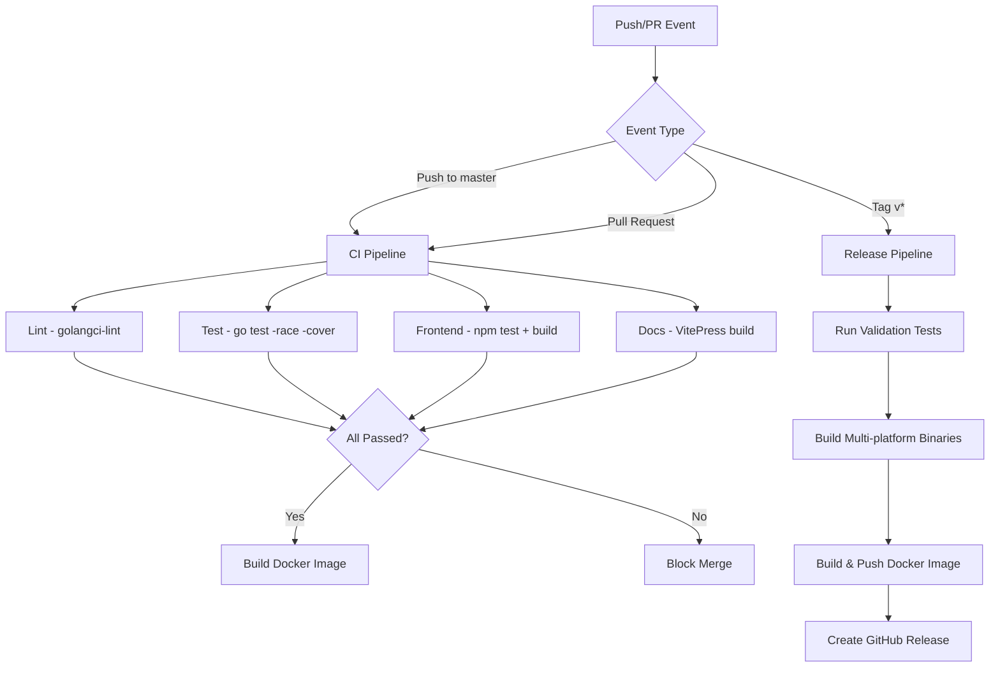

# RFC: CI/CD Architecture

> **Status**: implemented
> **Created**: 2026-03-08
> **Updated**: 2026-04-17
> **Related**: [Open Source Standards](../product/open-source-standards.md) (R5)

This RFC defines the CI/CD pipeline architecture for the ChatRoom project.

---

## Overview

The CI/CD pipeline automates testing, linting, building, and releasing to ensure code quality and streamline deployment.

---

## Pipeline Architecture

### Event-Driven Workflow



---

## CI Pipeline (ci.yml)

### Jobs

| Job | Purpose | Tools |
|-----|---------|-------|
| `lint` | Check code quality | golangci-lint |
| `test` | Run unit and integration tests | go test -race -cover |
| `frontend` | Validate frontend code and build | npm test, npm run build |
| `docs` | Build documentation site | VitePress |
| `build` | Compile backend binary | go build |
| `docker` | Build Docker image (master only) | docker build |

### Trigger Conditions

- **Runs on**: Every push to `master`, every PR
- **Docker build**: Only on `master` branch
- **Merge blocking**: All jobs must pass

---

## Release Pipeline (release.yml)

### Jobs

| Job | Purpose |
|-----|---------|
| `validate` | Run full test suite |
| `build-frontend` | Compile React application |
| `build-binaries` | Cross-compile for multiple platforms |
| `build-docker` | Build and push multi-architecture images |
| `create-release` | Create GitHub Release with changelog |

### Trigger Conditions

- **Runs on**: Git tags matching `v*` pattern
- **Version injection**: Via `-ldflags` with version, commit hash, build time

---

## Security Pipeline (security.yml)

### Scans

| Scan | Tool | Target |
|------|------|--------|
| Static Analysis | gosec | Go source code |
| Dependency Audit | npm audit | Frontend dependencies |
| Container Scan | trivy | Docker images |
| Secret Detection | gitleaks | Git history |

---

## Configuration

### CI Environment Variables

```yaml
env:
  GO_VERSION: "1.24"
  NODE_VERSION: "20"
  POSTGRES_VERSION: "16"
```

### Test Database Setup

CI tests require PostgreSQL, provisioned via GitHub Actions service containers:

```yaml
services:
  postgres:
    image: postgres:16
    env:
      POSTGRES_USER: chatroom
      POSTGRES_PASSWORD: chatroom
      POSTGRES_DB: chatroom_test
    ports:
      - 5432:5432
```

---

## Build Artifacts

### Binary Build

```bash
# Cross-compilation targets
GOOS=linux GOARCH=amd64 go build -o chatroom-linux-amd64
GOOS=darwin GOARCH=amd64 go build -o chatroom-darwin-amd64
GOOS=windows GOARCH=amd64 go build -o chatroom-windows-amd64.exe
```

### Docker Image

```dockerfile
# Multi-stage build
Stage 1: Frontend build (node:20-alpine)
Stage 2: Backend build (golang:1.24-alpine)
Stage 3: Runtime (alpine:3.21)
```

---

## Version Information

Build-time version injection:

```go
var (
    Version   = "dev"
    GitCommit = "unknown"
    BuildTime = "unknown"
)
```

Injected via:

```bash
go build -ldflags="-X main.Version=v0.2.0 -X main.GitCommit=abc123 -X main.BuildTime=2026-04-17"
```

---

## Pipeline Status

All pipelines implemented and operational as of v0.2.0 (March 2026).

**Workflow Files**:
- `.github/workflows/ci.yml` - Main CI pipeline
- `.github/workflows/release.yml` - Release pipeline
- `.github/workflows/security.yml` - Security scanning

---

## Change History

| Date | Change |
|------|--------|
| 2026-03-08 | Initial CI/CD design documented (Chinese) |
| 2026-04-17 | Migrated to SDD structure, translated to English |
