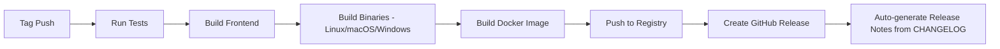

# RFC: Versioning Strategy

> **Status**: implemented
> **Created**: 2026-03-08
> **Updated**: 2026-04-17
> **Related**: [Open Source Standards](../product/open-source-standards.md) (R7)

This RFC defines the versioning and release strategy for the ChatRoom project.

---

## Overview

Semantic Versioning (SemVer) with automated release pipelines.

---

## Semantic Versioning

### Version Format: `MAJOR.MINOR.PATCH`

| Component | Increment When | Example |
|-----------|----------------|---------|
| MAJOR | Breaking API changes, architecture shifts | `1.0.0` |
| MINOR | New features, backward-compatible additions | `0.2.0` |
| PATCH | Bug fixes, backward-compatible fixes | `0.1.1` |

### Current Version

- **Latest Release**: `v0.3.0` (2026-04-16)
- **Development**: `v0.4.0-dev`

---

## Git Tagging

### Tag Format

```bash
v<major>.<minor>.<patch>
# Examples:
v0.1.0
v0.2.0
v0.3.0
v1.0.0
```

### Tagging Process

```bash
# 1. Update CHANGELOG.md
# 2. Commit changes
git commit -m "chore: prepare for v0.3.0 release"

# 3. Create tag
git tag -a v0.3.0 -m "Release v0.3.0: Documentation i18n"

# 4. Push tag (triggers release pipeline)
git push origin v0.3.0
```

---

## Release Pipeline

### Trigger

Git tags matching pattern `v*`

### Pipeline Steps



### Artifacts

| Artifact | Format | Platforms |
|----------|--------|-----------|
| Binary | ELF/Mach-O/PE | linux/amd64, darwin/amd64, windows/amd64 |
| Docker Image | OCI | linux/amd64, linux/arm64 |
| Source | tarball, zip | All |

---

## Version Information Injection

### Build-time Variables

```go
var (
    Version   = "dev"
    GitCommit = "unknown"
    BuildTime = "unknown"
)
```

### Build Command

```bash
go build -ldflags="\
  -X main.Version=v0.3.0 \
  -X main.GitCommit=$(git rev-parse --short HEAD) \
  -X main.BuildTime=$(date -u +%Y-%m-%dT%H:%M:%SZ)"
```

### Version Endpoint

```json
GET /version
{
  "version": "v0.3.0",
  "git_commit": "abc1234",
  "build_time": "2026-04-16T10:30:00Z",
  "go_version": "go1.24"
}
```

---

## CHANGELOG Format

Following [Keep a Changelog](https://keepachangelog.com/):

```markdown
## [0.3.0] - 2026-04-16

### Added
- Documentation internationalization (EN/ZH)
- VitePress docs site language selector

### Changed
- README structure improved
- AGENTS.md updated with SDD workflow

### Fixed
- Broken links in CONTRIBUTING.md
```

### Section Categories

| Section | Content |
|---------|---------|
| `Added` | New features |
| `Changed` | Changes to existing functionality |
| `Deprecated` | Soon-to-be removed features |
| `Removed` | Removed features |
| `Fixed` | Bug fixes |
| `Security` | Security-related changes |

---

## Release Checklist

### Pre-release

- [ ] All tests passing (`go test -race ./...`, `npm --prefix frontend run test`)
- [ ] Linting passing (`make lint`)
- [ ] CHANGELOG.md updated
- [ ] Version numbers updated
- [ ] Documentation updated

### Post-release

- [ ] Git tag created and pushed
- [ ] Docker image published
- [ ] GitHub Release created with artifacts
- [ ] ROADMAP updated
- [ ] Announce release (if major version)

---

## Version History

| Version | Date | Description |
|---------|------|-------------|
| v0.1.0 | 2025-01-08 | Initial release |
| v0.2.0 | 2026-03-08 | Open source standards compliance |
| v0.3.0 | 2026-04-16 | Documentation i18n |

---

## Change History

| Date | Change |
|------|--------|
| 2026-03-08 | Initial versioning strategy documented (Chinese) |
| 2026-04-17 | Migrated to SDD structure, translated to English |
